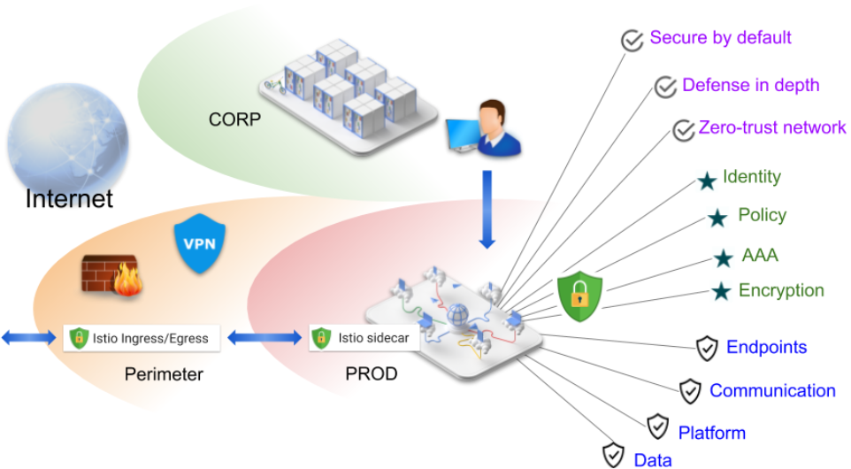
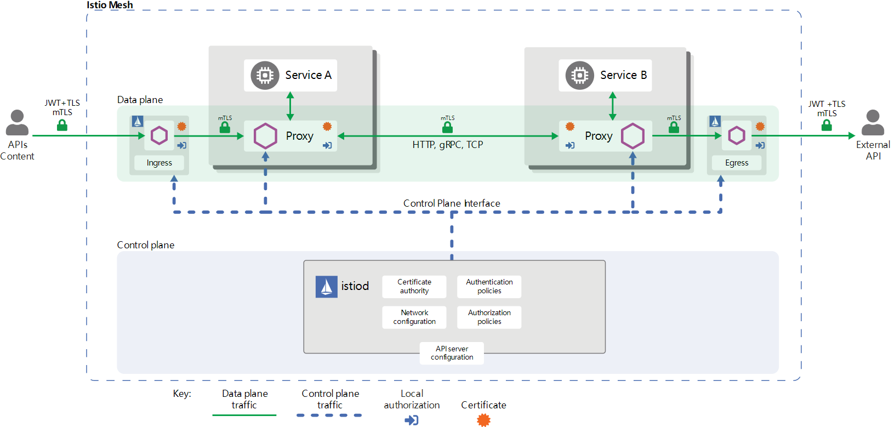
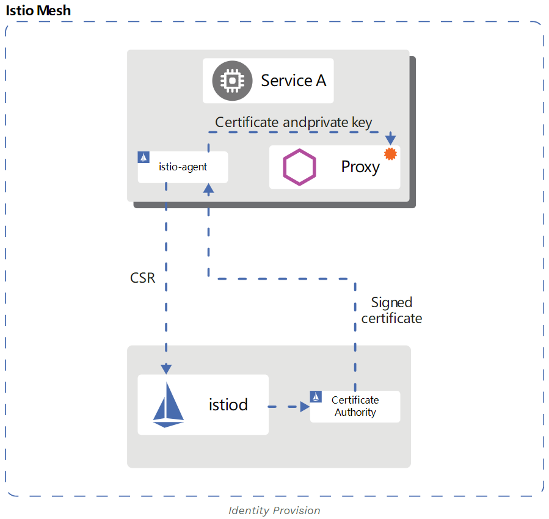
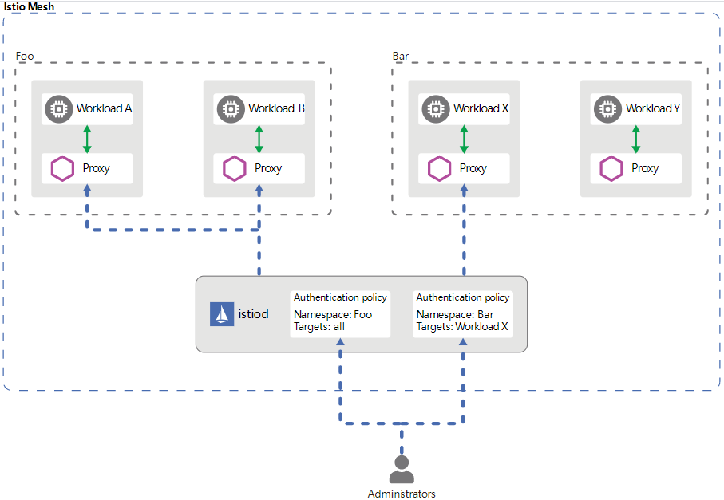

## Istio 安全(概念)

[TOC]

通过将一个单一应用划分为多个原子服务的方式，可以提供更好的灵活性，可扩展性以及重用服务的能力。然而微服务对安全有特殊的要求：

- 抵御中间人攻击，需要用到流量加密
- 提供灵活的服务访问控制，需要用到TLS和细粒度访问策略
- 决定哪些人在哪些时间可以做哪些事，需要用到审计工具

为了解决这些问题，istio提供了完整的安全方案。本章节全面介绍了如何使用istio对服务进行安全加固(无论该服务运行在哪里)。特别地，Istio的安全性可减轻来自内部和外部的(对数据，终端，通信和平台的)威胁。



Istio安全特性提供了强大的身份、策略、透明TLS加密，以及认证，授权和审计(AAA)等功能来对服务和数据进行防护。istio安全的目标是：

- 默认安全：不需要对应用代码和基础架构进行任何改变
- 深度防护：与现有的安全系统结合，来提供多个层面的防护
- 0-信任网络：在不信任的网络上构建安全解决方案

查看[multual TLS迁移文档](https://istio.io/docs/tasks/security/authentication/mtls-migration/)，了解如何在已部署的服务上使用istio安全特性。通过[安全任务](https://istio.io/docs/tasks/security/)了解更多的细节。

### 高层架构

istio的安全涉及多个组件：

- 用于密钥和证书管理的证书颁发机构（CA）
- 分发给代理的API server配置：
  - [认证策略](https://istio.io/docs/concepts/security/#authentication-policies)
  - [授权策略](https://istio.io/docs/concepts/security/#authorization-policies)
  - [安全命名信息](https://istio.io/docs/concepts/security/#secure-naming)
- Sidecar和外围代理作为策略执行点([pep](https://www.jerichosystems.com/technology/glossaryterms/policy_enforcement_point.html))来确保客户端和服务器之间的通信安全。
- 通过一系列Envoy扩展来管理遥测和审计

控制面负责接收来自API server的配置信息，并在数据面配置PEP。PEP使用Envoy实现。架构如下，可以看到各个Envoy代理直接可以使用mTLS实现(默认启用ISTIO_MUTUAL)



### Istio身份

身份是所有安全设施的最基本概念。在工作负载到工作负载的通信开始时，双方必须交换携带各自身份信息的凭据来进行双向认证。客户端会将服务的身份与[安全命名](https://istio.io/latest/docs/concepts/security/#secure-naming)信息进行比对，来查看该服务是否是授权的工作负载运行器；服务端会根据[授权策略](https://istio.io/docs/concepts/security/#authorization-policies)来决定客户端可以访问的内容，审计记录谁在什么时间访问了什么内容，根据负载控制客户端的行为，以及拒绝没有支付被访问负载的客户端。

istio身份模型使用一级服务标识(`service identity` )来确定请求源的身份。该模型使用更大的灵活性和颗粒度来标识一个用户，单独的负载，或一组负载。在没有服务标识的平台上，isito可以使用其他标识来对负载实例进行分组，如服务名称。

下面展示了不同平台上可以使用的服务标识：

- Kubernetes: Kubernetes service account
- GKE/GCE: GCP service account
- GCP: GCP service account
- AWS: AWS IAM user/role account
- On-premises (non-Kubernetes): user account, custom service account, service name, Istio service account, or GCP service account. The custom service account refers to the existing service account just like the identities that the customer’s Identity Directory manages.

### 身份和证书管理

istio的安全使用X.509证书为每个负载提高了强身份标识。每个Envoy代理旁都会运行一个istio agent，istio agent与`istiod`配合，可以在扩展时实现证书的自动滚动。下面展示了证书配置流程：



isito通过secert发现(SDS)机制来处理身份认证，处理过程为：

- istiod提供了一个gRPC服务来处理CSR(证书签名请求)
- Envoy通过Envoy SDS API发送证书和密钥请求
- 在接收到SDS请求后，istio agent会(在将携带凭据的CSR发送`istiod`前)创建私钥和CSR
- CA会校验CSR携带的凭据，并签发CSR来生成证书
- istio agent通过Envoy SDS API将来自isitod的证书和密钥发送给Envoy
- 周期性地执行如上CSR处理流程来滚动证书和密钥

### 认证

isito提供两种类型的认证：

- [对等认证](https://istio.io/latest/docs/reference/config/security/peer_authentication/)：用于服务到服务的身份验证，验证建立连接的客户端。Istio提供了mutual TLS作为传输身份验证的全栈解决方案，这种方式无需修改服务代码，该方案：
  - 为每个服务提供了强标识作为角色(role)，支持跨集群和云的互操作性。
  - 确保服务到服务的通信安全。
  - 提供了密钥管理系统来自动生成，分发，滚动密钥和证书。
- [请求认证](https://istio.io/latest/docs/reference/config/security/request_authentication/)：用于终端用户认证，校验请求中的凭据。Istio请求级认证使用了JSON Web Token(JWT)验证，以及基于自定义身份验证或OpenID Connect开发的程序，如：
  - [ORY Hydra](https://www.ory.sh/)
  - [Keycloak](https://www.keycloak.org/)
  - [Auth0](https://auth0.com/)
  - [Firebase Auth](https://firebase.google.com/docs/auth/)
  - [Google Auth](https://developers.google.com/identity/protocols/OpenIDConnect)

在所有场景中，istio通过一个用户自定义的Kubernetes API将认证策略保存在`Istio config store` 中。istiod会将这些策略更新到每个代理中，并提供合适的密钥。此外，istio支持permissive 模式的身份验证，可以帮助理解一个策略在强制执行前如何影响安全状态。

#### Mutial TLS认证

Istio通过客户端和服务器端的PEP实现服务到服务的通信，PEP使用[Envoy代理](https://www.envoyproxy.io/docs/envoy/latest/)来实现。当一个负载使用mutual TLS认证向另一个负载发送请求时，该请求的处理流程如下：

1. isito将出站流量从客户端重路由到客户端的本地sidecar Envoy中
2. 客户端侧的Envoy与服务端侧的Envoy开始双向TLS握手。在握手期间，客户端侧的Envoy也会进行[安全命名](https://istio.io/docs/concepts/security/#secure-naming)校验，确保可以通过授权服务端证书中的service account来执行目标服务。
3. 客户端侧的Envoy和服务端侧的Envoy建立双向TLS连接，istio会将流量从客户端的Envoy转发到服务端侧的Envoy
4. 在授权后，服务端测的Envoy会通过本地TCP连接将流量转发到服务端的服务中。

##### 宽容(Permissive)模式

istio mutual TLS有一个宽容模式，它允许一个服务同时接收明文流量和TLS加密的流量。该特性极大提升了mutual TLS的使用体验。

在很多非istio的客户端和非istio的服务端架构中，当计划将服务端迁移到启用mutual TLS的istio上时都会遇到问题。通常，操作人员无法同时给所有的客户端安装一个sidecar，或没有权限这么做。即使在所有的服务端安装istio sidecar后，操作人员仍然无法在不中断现有连接的情况下启用mutual TLS。

使用宽容模式时，服务端可以同时接收明文和mutual TLS的流量。该模式极大提升了使用istio的灵活性。服务端在安装istio sidecar后，也可以在不中断现有明文流量的情况下接收mutual TLS流量。这样，就可以通过逐步安装并配置客户端的istio sidecar来发送mutual TLS流量。一旦完成客户端的配置，操作人员就可以将服务端配置为仅mutual TLS模式。更多信息，参见[mutual TLS迁移指南](https://istio.io/docs/tasks/security/authentication/mtls-migration/)。

##### 安全命名

服务的凭据编码到了证书中，但服务名称是通过发现服务或DNS进行检索的。安全命名信息将服务的身份信息映射到服务名称上。一个身份`A`映射到服务名称`B`，表示授权`A`运行服务`B`。控制面会通过watch `apiserver`来生成安全命名映射，并将其安全地分发到PEP上。下面解释安全命名为什么对认证至关重要。

假设合法的服务器运行了服务`datastore`，且仅使用了`infra-team`身份。一个恶意的用户使用了`test-team`身份的证书和密钥，该用户尝试冒充服务来分析来自客户端的数据。该恶意用户使用`test-team`身份的证书和密钥部署了一个伪造的服务器。假设该恶意用户成功劫持(通过DNS欺骗，BGP/路由劫持，ARP欺骗等)了发往`datastore`的流量，并将流量重定向到伪造的服务。

当一个客户端调用`datastore`服务时，它会从服务的证书中抽取出`test-team`身份，然后使用安全命名信息校验`test-team`是否允许运行`datastore`，此时客户端会探测到`test-team`不允许`datastore`服务，认证失败。

安全命名能够防止HTTPS流量被网络劫持，也能够防止TCP流量被网络劫持。但安全命名无法防止DNS欺骗，因为这种情况下，攻击者会劫持DNS并修改目的地的IP地址，而TCP流量不包含主机信息，仅能依赖IP地址进行路由。事实上，这种DNS劫持甚至在客户端的Envoy收到流量之前就有可能发生。

#### 认证架构

可以使用对等和请求认证策略为在Istio网格中接收请求的工作负载指定身份认证。网格操作人员可以使用`.yaml`文件指定策略。一旦部署后，会将策略保存在istio的配置存储中。isito控制器会监视配置存储。

当策略变更后，新的策略会转变为合适的配置，告诉PEP如何执行需要的认证机制。控制平面可能会拉取公钥，并将其添加到配置中，用于JWT校验。或者，isito会提供istio系统管理的密钥和证书的路径，并将它们安装到应用pod中，用于mutual TLS。更多参见[身份和证书管理](https://istio.io/docs/concepts/security/#pki)。

istio会异步地将配置发送给目标终端。一旦代理接收到该配置，新的配置会在该pod上立即生效。

发送请求的客户端服务负责遵循必要的身份认证机制。对于对等认证，应用负责获取JWT凭证并将其附加到请求上；对于mutual TLS，istio会自动在两个PEP间自动升级所有的流量。如果认证取消了mutual TLS模式，isito会在PEP间继续使用明文。为了覆盖这种行为，需要在[destination rules](https://istio.io/docs/concepts/traffic-management/#destination-rules)中取消mutual TLS模式。


istio会使用上述两种认证方式，以及凭证中声明的其他信息（如果适用）将身份信息输出到下一层：[授权](https://istio.io/docs/concepts/security/#authorization)。

##### 认证策略

本节展示了istio认证策略的工作细节。身份认证策略应用于服务接收的请求，为了在mutual TLS中给指定客户端侧的认证规则，需要在`DestinationRule`中指定`TLSSettings`，更多参见[TLS设置文档](https://istio.io/docs/reference/config/networking/destination-rule/#ClientTLSSettings)。

与其他istio配置类似，可以在`.yaml`文件中指定配置策略，并使用`kubectl`部署。下面的认证策略指定了带`app:reviews`标签的负载的传输认证必须使用mutual TLS。

> `DestinationRule`中设置使用哪种类型的TLS：DISABLE|SIMPLE|MUTUAL|ISTIO_MUTUAL，然后在单独的[资源](https://istio.io/latest/docs/reference/config/security/)中指定具体的认证和授权策略(当然也可以单独使用认证和授权策略)。

```yaml
apiVersion: "security.istio.io/v1beta1"
kind: "PeerAuthentication"
metadata:
  name: "example-peer-policy"
  namespace: "foo"
spec:
  selector:
    matchLabels:
      app: reviews
  mtls:
    mode: STRICT
```

> mtls的模式如下：
>
> | Name         | Description                                                  |
> | ------------ | ------------------------------------------------------------ |
> | `UNSET`      | Inherit from parent, if has one. Otherwise treated as PERMISSIVE. |
> | `DISABLE`    | Connection is not tunneled.                                  |
> | `PERMISSIVE` | Connection can be either plaintext or mTLS tunnel.           |
> | `STRICT`     | Connection is an mTLS tunnel (TLS with client cert must be presented). |

##### 策略存储

istio将网格范围的策略保存在根命名空间中。这些策略有一个空的`selector`，应用到网格中的所有负载上。带命名空间的策略会保存到对应的命名空间中，仅应用到该命名空间中的负载上。如果配置了`selector`字段，认证策略仅会应用到匹配的负载上。

**对等**和**请求**认证策类型分别为`PeerAuthentication`和`RequestAuthentication`。

##### Selector字段

对等和请求认证策略使用`selector`字段指定应用策略的负载标签。下例展示了一个策略的`selector`字段，应用到具有`app:product-page`标签的负载。

```yaml
selector:
     matchLabels:
       app:product-page
```

如果没有为`selector`字段提供任何值，策略会应用到其存储范围内的所有负载上。通过`selector`字段可以帮助指定策略的作用范围：

- 网络范围策略：根命名空间中的策略，不使用`selector`字段或使用空的`selector`字段
- 命名空间范围策略：特定的非根命名空间中的策略，不使用`selector`字段或使用空的`selector`字段
- 指定负载策略：定义在常规命名空间中的策略，使用非空的`selector`字段

对等方和请求身份验证策略对`selector`字段遵循相同的层次结构原则，但Istio会以稍微不同的方式组合和应用它们。

只能存在一个网格范围的对等认证策略，每个命名空间中只能存在一个命名空间范围的对等认证策略。在相同的网格或命名空间中配置多网格范围或多命名空间范围的对等认证策略时，istio或忽略新添加的策略。当匹配到多个指定负载的对等认证策略时，istio会选择最老的一条。

Istio按照以下顺序为每个工作负载指定应用范围最小的匹配策略：

1. 指定负载
2. 命名空间范围
3. 网格范围

Istio可以将所有匹配的请求身份认证策略组合起来，就如同这些策略为单个请求身份认证策略一样。因此，可以在一个网格或命名空间中存在多个网格范围或命名空间范围的策略。但是，最好避免存在多个网格范围或命名空间范围的请求认证策略。

##### 对等认证

对等认证策略强制在目标负载上指定了mutual TLS模型。支持如下模型：

- `PERMISSIVE`：负载同时接受mutual TLS和明文流量。该模式通常用于迁移不带sidecar的负载，此时该负载无法使用mutual TLS。一旦负载迁移结束，并注入sidecar，此时应该将模式切换为STRICT。
- `STRICT`：负载仅接受mutual TLS流量。
- `DISABLE`：禁用mutual TLS。从安全的角度看，除非提供了其他安全方案，否则不应该使用该模式

如果没有设置模式，则会继承父范围的模式。网格范围的对等认证策略默认使用`PERMISSIVE`模式。

下面的对等认证策略要求命名空间`foo`中的所有负载使用mutual TLS。

```yaml
apiVersion: "security.istio.io/v1beta1"
kind: "PeerAuthentication"
metadata:
  name: "example-policy"
  namespace: "foo"
spec:
  mtls:
    mode: STRICT
```

使用指定负载的对等认证策略时，可以为不同的端口指定不同的mutual TLS模式。下例中，禁止在 `app:example-app` 负载的`80`端口上使用mutual TLS，而其他端口使用命名空间范围的对等认证策略。

```yaml
apiVersion: "security.istio.io/v1beta1"
kind: "PeerAuthentication"
metadata:
  name: "example-workload-policy"
  namespace: "foo"
spec:
  selector:
     matchLabels:
       app: example-app
  portLevelMtls:
    80:
      mode: DISABLE
```

> portLevelMtls可以对不同的端口应用不同的认证策略

下面的service配置将来自负载`example-app`的请求绑定到`example-service`的80端口，只有这样，上述的对等认证策略才能运行。

```yaml
apiVersion: v1
kind: Service
metadata:
  name: example-service
  namespace: foo
spec:
  ports:
  - name: http
    port: 8000
    protocol: TCP
    targetPort: 80
  selector:
    app: example-app
```

##### 请求认证

请求认证策略指定了校验JSON Web Token (JWT)的值。这些值包括：

- 请求中的token的位置
- 发起者或请求
- 公共的JSON Web Key Set (JWKS)

istio校验出现的token，如果违反请求身份认证策略中的规则，则视为无效的token，拒绝该请求。如果请求中没有携带token，默认情况下会接受这些请求。为了拒绝不带token的请求，需要通过认证规则(例如路径或动作)限制特定的操作。

如果每个请求身份认证策略使用唯一的位置，则可以指定多个JWT。当多个策略匹配到一个负载时，istio会将所有的规则结合起来(就像一个独立的策略一样)。这种方式对于编写可以接受来自不同提供方的JWT的工作负载来说非常有用。然而，无法支持具有多个JWT的请求，因为未定义这类请求的输出主体。

##### 主体(Principals)

当使用对等认证策略和mutual TLS时，istio会从对等认证中抽取身份信息，并保存到`source.principal`中。类似地，当使用请求认证策略时，istio会将JWT的身份信息分配到 `request.auth.principal`中。isito使用这些主体设置认证策略和遥测输出。

> 对于mutual TLS来说主体为k8s的service account；对于请求认证来说，主体为使用分隔符组合起来的JWT token的`iss`和`sub` claim。参见[source](https://istio.io/latest/docs/reference/config/security/authorization-policy/#Source)

#### 升级认证策略

可以在任何时候修改认证策略，isito会将新的策略实时推送到负载上。然而，isito不能保证所有的负载在同一时间接收到新的策略。以下实现帮助避免在更新认证策略时导致的混乱：

- 在将模式从`DISABLE` 切换到`STRICT`时，中间对等身份认证策略使用`PERMISSIVE`模式，反之亦然。当所有的负载切换到期望的模式后，可以将策略修改为最终的模式。可以使用isito的遥测校验负载是否切换成功。
- 当请求认证策略从JTW切换到另一个JWT时，将新的JWT的规则添加到策略中，而不删除旧的规则。此时负载会接受两个类型的JWT，当所有的流量切换到新的JWT时，就可以移除老的规则。然而，每个JWT都需要使用不同的位置。

### 授权

istio的授权特性提供了网格，命名空间和负载范围内的访问控制。这些不同级别的控制提供了如下便利：

- 负载到负载以及终端用户到负载的授权
- 简单的API：包括一个便于使用和维护的[`AuthorizationPolicy` CRD](https://istio.io/docs/reference/config/security/authorization-policy/)
- 灵活的语义：操作人员可以在Istio属性上定义自定义条件，并使用`DENY`和`ALLOW`导动作。
- 高性能：istio的授权运行在本地的Envoy上。
- 高兼容性：支持给RPC，HTTP，HTTPS和HTTP2，以及普通TCP协议。

#### 授权架构

每个Envoy代理都运行了一个在运行时授权请求的授权引擎。当代理接收到一个请求，授权引擎会使用当前的授权策略评估请求上下文，并返回授权结果，`ALLOW` 或`DENY`。操作人员可以在`.yaml`文件中指定授权策略。



#### 隐式启用

无需明确启用istio的授权特性。只需将授权策略应用于工作负载即可执行访问控制。对于未应用授权策略的工作负载，Istio不会执行允许所有请求的访问控制。

授权策略支持`ALLOW`和`DENY`，deny 策略优先allow 策略。如果allow 策略应用到一个负载，则对该负载的访问默认是deny 的，除非明确在策略规则中允许该访问。当一个负载上应用了而多个授权策略，则istio会叠加这些策略。

#### 授权策略

为了配置授权策略，需要创建一个名为[`AuthorizationPolicy` ](https://istio.io/docs/reference/config/security/authorization-policy/)的自定义资源。一个授权策略包含一个`selector`，一个`action`和一个`rules`列表：

- `selector`字段指定了策略的目标
- `action`字段指定了是否允许或拒绝请求。
- `rules`指定了何时触发`action`
  - `rules`中的`from`字段指定了请求源
  - `rules`中的`to`字段指定了请求的操作
  - `when`字段指定了应用规则的条件

下面例子展示了允许两个源的授权策略，即`cluster.local/ns/default/sa/sleep` service account和`dev`命名空间，在请求发送了有效的JWT token后可以访问带有`foo`命名空间中带有`app: httpbin`和`version: v1` 标签的负载

```yaml
apiVersion: security.istio.io/v1beta1
kind: AuthorizationPolicy #授权策略资源
metadata:
 name: httpbin
 namespace: foo
spec:
 selector:
   matchLabels:
     app: httpbin
     version: v1
 action: ALLOW
 rules:
 - from:
   - source:
       principals: ["cluster.local/ns/default/sa/sleep"]
   - source:
       namespaces: ["dev"]
   to:
   - operation:
       methods: ["GET"]
   when:
   - key: request.auth.claims[iss]
     values: ["https://accounts.google.com"]
```

下例的授权策略拒绝来自非`foo`命名空间的source的请求。

```yaml
apiVersion: security.istio.io/v1beta1
kind: AuthorizationPolicy
metadata:
 name: httpbin-deny
 namespace: foo
spec:
 selector:
   matchLabels:
     app: httpbin
     version: v1
 action: DENY
 rules:
 - from:
   - source:
       notNamespaces: ["foo"]
```

**拒绝策略优先于允许策略**。如果匹配了一个deny策略，即使匹配到allow策略，此时也应该拒绝该请求。isito会首先评估deny策略，保证allow策略不会绕过deny策略。

##### 策略目标

可以使用 `metadata/namespace` 字段和可选的`selector` 字段来决定策略的范围和策略的目标。策略会应用到`metadata/namespace`字段中的命名空间。如果该值设置到了根命名空间，则策略会应用到网格中的所有命名空间。根命名空间是可配置的，默认为`istio-system`。如果设置为其他命名空间，则策略仅会应用到指定的命名空间。

可以使用`selector`字段进一步限制策略应用的负载。`selector`使用标签来选择目标负载。`selector`包含一些列`{key: value}` 对，`key`为标签的名称。如果没有设置，授权策略会应用到相同命名空间中的所有负载上。

例如，`allow-read`策略允许使用`"GET"` 和`"HEAD"` 访问`default`命名空间中带有`app: products` 标签的负载。

```yaml
apiVersion: security.istio.io/v1beta1
kind: AuthorizationPolicy
metadata:
  name: allow-read
  namespace: default
spec:
  selector:
    matchLabels:
      app: products
  action: ALLOW
  rules:
  - to:
    - operation:
         methods: ["GET", "HEAD"]
```

##### 值匹配

授权策略中的大部分字段支持下面的匹配框架：

- 完全匹配：字符串完全匹配。
- 前缀匹配：使用"\*"结尾的字符串。例如 `"test.abc.*"` 匹配`"test.abc.com"`, `"test.abc.com.cn"`, `"test.abc.org"`等。
- 后缀匹配：使用"\*"开头的字符串。例如 `"*.abc.com"` 匹配`"eng.abc.com"`, `"test.eng.abc.com"`等。
- 存在匹配：使用`*`指定非空的字符串。 可以使用 `fieldname: ["*"]`格式指定一个必须存在的字段，不同于未指定字段，未指定字段可以匹配任何内容，包括空的。

这里有一些例外，如以下字段仅支持完全匹配：

- `when`部分的`key`字段
- `under`部分的`ipBlocks`字段
- `to`部分的`ports`字段

下例中展示了策略允许访问`/test/*` 作为前缀或使用`*/info` 作为后缀的路径。

```yaml
apiVersion: security.istio.io/v1beta1
kind: AuthorizationPolicy
metadata:
  name: tester
  namespace: default
spec:
  selector:
    matchLabels:
      app: products
  action: ALLOW
  rules:
  - to:
    - operation:
        paths: ["/test/*", "*/info"]
```

##### 排除匹配

为了匹配像`when`字段中的`notValue`，`source`字段中的`notIpBlocks`，`to`字段中的`notPorts`之类的消极条件，istio支持排除匹配。下例策略允许请求路径非`/healthz`，且由JWT认证的有效的请求主体。这样策略会排除使用JWT认证的到`/healthz`的请求。

```yaml
apiVersion: security.istio.io/v1beta1
kind: AuthorizationPolicy
metadata:
  name: disable-jwt-for-healthz
  namespace: default
spec:
  selector:
    matchLabels:
      app: products
  action: ALLOW
  rules:
  - to:
    - operation:
        notPaths: ["/healthz"]
    from:
    - source:
        requestPrincipals: ["*"]
```

下例会拒绝到达`/admin`路径的不带请求主体的请求。

```yaml
apiVersion: security.istio.io/v1beta1
kind: AuthorizationPolicy
metadata:
  name: enable-jwt-for-admin
  namespace: default
spec:
  selector:
    matchLabels:
      app: products
  action: DENY
  rules:
  - to:
    - operation:
        paths: ["/admin"]
    from:
    - source:
        notRequestPrincipals: ["*"]
```

##### 允许所有以及默认拒绝所有认证策略

下例展示了一个简单的`allow-all`认证策略，该策略允许访问`default`命名空间中的所有负载。

```yaml
apiVersion: security.istio.io/v1beta1
kind: AuthorizationPolicy
metadata:
  name: allow-all
  namespace: default
spec:
  action: ALLOW
  rules:
  - {}
```

下例的策略拒绝访问admin命名空间的所有负载：

```yaml
apiVersion: security.istio.io/v1beta1
kind: AuthorizationPolicy
metadata:
  name: deny-all
  namespace: admin
spec:
  {}
```

##### 自定义条件

可以在`when`部分指定其他条件。例如，如下`AuthorizationPolicy`定义包含一个条件，即 `request.headers[version]` 为`"v1"` 或 `"v2"`。这种情况下，key为`request.headers[version]`，属于istio `request.headers`属性中的一项，类型为map。

```yaml
apiVersion: security.istio.io/v1beta1
kind: AuthorizationPolicy
metadata:
 name: httpbin
 namespace: foo
spec:
 selector:
   matchLabels:
     app: httpbin
     version: v1
 action: ALLOW
 rules:
 - from:
   - source:
       principals: ["cluster.local/ns/default/sa/sleep"]
   to:
   - operation:
       methods: ["GET"]
   when:
   - key: request.headers[version]
     values: ["v1", "v2"]
```

支持的`key`可以参见[官方文档](https://istio.io/docs/reference/config/security/conditions/)

##### 认证和未认证的身份

如果要将一个负载可以公开访问，需要将`source`部分置为空。这样会允许所有(认证和未认证的)的用户和负载进行访问，如：

```yaml
apiVersion: security.istio.io/v1beta1
kind: AuthorizationPolicy
metadata:
 name: httpbin
 namespace: foo
spec:
 selector:
   matchLabels:
     app: httpbin
     version: v1
 action: ALLOW
 rules:
 - to:
   - operation:
       methods: ["GET", "POST"]
```

如果要仅允许认证的用户，将`principals`设置为`*`，如：

```yaml
apiVersion: security.istio.io/v1beta1
kind: AuthorizationPolicy
metadata:
 name: httpbin
 namespace: foo
spec:
 selector:
   matchLabels:
     app: httpbin
     version: v1
 action: ALLOW
 rules:
 - from:
   - source:
       principals: ["*"]
   to:
   - operation:
       methods: ["GET", "POST"]
```

##### 使用istio授权普通TCP协议

isito授权支持负载使用普通TCP协议，如MongoDB。这种情况下的授权策略的配置与HTTP负载相同，不同之处在于，特定的字段和条件仅适用于HTTP工作负载，这些字段包括：

- 授权策略对象的`source`部分的`request_principals` 字段
- 授权策略对象的`operation`部分的`hosts`, `methods` 和`paths` 字段

支持的条件参见[官方文档](https://istio.io/docs/reference/config/security/conditions/)。如果TCP负载中使用了任何仅HTTP支持的字段，则istio会在授权策略中忽略这些仅HTTP格式的字段。

假设一个MongoDB服务的端口为`27017`，下例配置了一个授权策略，仅允许istio网格中的`bookinfo-ratings-v2` 服务访问MongoDB负载。

```yaml
apiVersion: "security.istio.io/v1beta1"
kind: AuthorizationPolicy
metadata:
  name: mongodb-policy
  namespace: default
spec:
 selector:
   matchLabels:
     app: mongodb
 action: ALLOW
 rules:
 - from:
   - source:
       principals: ["cluster.local/ns/default/sa/bookinfo-ratings-v2"]
   to:
   - operation:
       ports: ["27017"]
```

#### mutual TLS的依赖

Istio使用mutual TLS将信息从客户端安全地传递到服务器。必须在授权策略中使用如下字段前启用mutual TLS。

- `source`部分的`principals`字段
- `source`部分的`namespaces`字段
- `source.principal`自定义条件
- `source.namespace` 自定义条件
-  `connection.sni`自定义条件

如果授权策略中没有使用上述任何一个字段，则不需要mutual TLS。