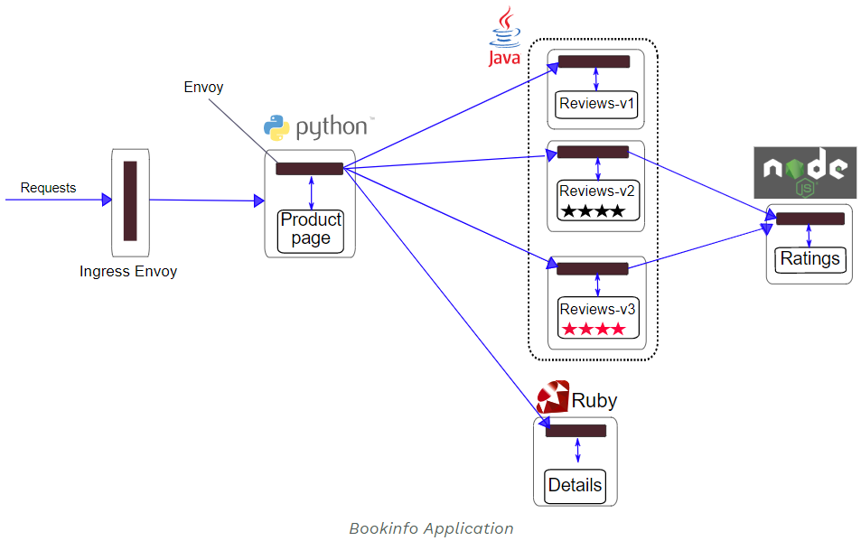

# Istio的流量管理(实操一)(istio 系列三)

使用官方的[Bookinfo](https://istio.io/docs/examples/bookinfo/)应用进行测试。涵盖官方文档[Traffic Management](https://istio.io/docs/tasks/traffic-management/)章节中的请求路由，故障注入，流量迁移，TCP流量迁移，请求超时，熔断处理和流量镜像。不含ingress和Egree，后续再补充。

[TOC]

## 部署Bookinfo应用

### Bookinfo应用说明

官方提供的测试应用如下，包含如下4个组件：

- `productpage`： `productpage` 服务会调用`details` 和 `reviews`来填充web页面.
- `details`：`details` 服务包含book信息.
- `reviews`： `reviews` 服务包含书评，它会调用 `ratings` 服务.
- `ratings`：`ratings` 服务包与书评相关的含排名信息

`reviews` 包含3个版本：

- v1版本不会调用 `ratings` 服务.
- v2版本会调用 `ratings` 服务,并按照1到5的黑色星展示排名
- v2版本会调用 `ratings` 服务,并按照1到5的红色星展示排名



### 部署

Bookinfo应用部署在`default`命名空间下，使用自动注入sidecar的方式：

- 通过如下命令在`default`命名空间(当然也可以部署在其他命名空间下面，Bookinfo配置文件中并没有指定部署的命名空间)中启用自动注入sidecar:

  ```shell
  $ cat <<EOF | oc -n <target-namespace> create -f -
  apiVersion: "k8s.cni.cncf.io/v1"
  kind: NetworkAttachmentDefinition
  metadata:
    name: istio-cni
  EOF
  ```

  ```shell
  $ kubectl label namespace default istio-injection=enabled
  ```

- 切换在`default`命名空间下，部署Bookinfo应用：

  ```shell
  $ kubectl apply -f samples/bookinfo/platform/kube/bookinfo.yaml
  ```

  等待一段时间，Bookinfo的所有pod就可以成功启动，查看pod和service：

  ```shell
  $ oc get pod
  NAME                              READY   STATUS    RESTARTS   AGE
  details-v1-78d78fbddf-5mfv9       2/2     Running   0          2m27s
  productpage-v1-85b9bf9cd7-mfn47   2/2     Running   0          2m27s
  ratings-v1-6c9dbf6b45-nm6cs       2/2     Running   0          2m27s
  reviews-v1-564b97f875-ns9vz       2/2     Running   0          2m27s
  reviews-v2-568c7c9d8f-6r6rq       2/2     Running   0          2m27s
  reviews-v3-67b4988599-ddknm       2/2     Running   0          2m27s
  ```

  ```shell
  $ oc get svc                                              
  NAME          TYPE           CLUSTER-IP     EXTERNAL-IP   PORT(S)    AGE
  details       ClusterIP      10.84.97.183   <none>        9080/TCP   3m33s
  kubernetes    ClusterIP      10.84.0.1      <none>        443/TCP    14d
  productpage   ClusterIP      10.84.98.111   <none>        9080/TCP   3m33s
  ratings       ClusterIP      10.84.237.68   <none>        9080/TCP   3m33s
  reviews       ClusterIP      10.84.39.249   <none>        9080/TCP   3m33s
  ```

  使用如下命令判断Bookinfo应用是否正确安装：

  ```shell
  $ kubectl exec -it $(kubectl get pod -l app=ratings -o jsonpath='{.items[0].metadata.name}') -c ratings -- curl productpage:9080/productpage | grep -o "<title>.*</title>"
  
  <title>Simple Bookstore App</title> #返回的结果
  ```

  也可以直接通过svc的endpoint进行访问

  ```shell
  $ oc describe svc productpage|grep Endpoint
  Endpoints:         10.83.1.85:9080
  ```

  ```shell
  $ curl -s 10.83.1.85:9080/productpage | grep -o "<title>.*</title>"
  ```

  可在openshift中创建`router`(属于kuberenetes的ingress gateway)进行访问(将${HOST_NAME}替换为实际的主机名)

  ```yaml
  kind: Route
  apiVersion: route.openshift.io/v1
  metadata:
    name: productpage
    namespace: default
    labels:
      app: productpage
      service: productpage
    annotations:
      openshift.io/host.generated: 'true'
  spec:
    host: ${HOST_NAME}
    to:
      kind: Service
      name: productpage
      weight: 100
    port:
      targetPort: http
    wildcardPolicy: None
  ```

  > 此处先不根据官方文档配置ingress，后续再配置

- 配置默认的destination rules

  配置带mutual TLS(一开始学习istio时不建议配置)

  ```shell
  $ kubectl apply -f samples/bookinfo/networking/destination-rule-all.yaml
  ```

  配置不带mutual TLS

  ```shell
  $ kubectl apply -f samples/bookinfo/networking/destination-rule-all-mtls.yaml
  ```

  获取配置的destination rules

  ```shell
  $ kubectl get destinationrules -o yaml
  ```

  获取到的destination rules如下，注意默认安装下，除了`reviews`外的service只有`v1`版本

  ```yaml
  - apiVersion: networking.istio.io/v1beta1
    kind: DestinationRule
    metadata:
      annotations:
        ...
      name: details
      namespace: default
    spec:
      host: details    #对应kubernetes service "details"
      subsets:
      - labels:        #实际的details的deployment只有一个标签"version: v1"
          version: v1
        name: v1
      - labels:
          version: v2
        name: v2
  	  
  - apiVersion: networking.istio.io/v1beta1
    kind: DestinationRule
    metadata:
      annotations:
        ...
      name: productpage
      namespace: default
    spec:
      host: productpage
      subsets:
      - labels:
          version: v1
        name: v1
  	  
  - apiVersion: networking.istio.io/v1beta1
    kind: DestinationRule
    metadata:
      annotations:
        ...
      name: ratings
      namespace: default
    spec:
      host: ratings
      subsets:
      - labels:
          version: v1
        name: v1
      - labels:
          version: v2
        name: v2
      - labels:
          version: v2-mysql
        name: v2-mysql
      - labels:
          version: v2-mysql-vm
        name: v2-mysql-vm
  	  
  - apiVersion: networking.istio.io/v1beta1
    kind: DestinationRule
    metadata:
      annotations:
        ...
      name: reviews     # kubernetes service "reviews"实际中有3个版本
      namespace: default
    spec:
      host: reviews
      subsets:
      - labels:
          version: v1
        name: v1
      - labels:
          version: v2
        name: v2
      - labels:
          version: v3
        name: v3
  ```

### 卸载

使用如下命令可以卸载Bookinfo

```shell
$ samples/bookinfo/platform/kube/cleanup.sh
```

## 流量管理

### [请求路由](https://istio.io/docs/tasks/traffic-management/request-routing/)

下面展示如何根据官方提供的[Bookinfo](https://istio.io/docs/examples/bookinfo/)微服务的多个版本动态地路由请求。在上面部署BookInfo应用之后，该应用有3个`reviews`服务，分别提供：无排名，有黑星排名，有红星排名三种显示。由于默认情况下istio会使用轮询模式将请求一次分发到3个`reviews`服务上，因此在刷新`/productpage`的页面时，可以看到如下变化：

- V1版本：

  

- V2版本：

  

- V3版本：

  

本次展示如何将请求仅分发到某一个`reviews`服务上。

首先创建如下virtual service：

```shell
$ kubectl apply -f samples/bookinfo/networking/virtual-service-all-v1.yaml
```

查看路由信息

```shell
$ kubectl get virtualservices -o yaml
```

```yaml
- apiVersion: networking.istio.io/v1beta1
  kind: VirtualService
  metadata:
    annotations:
      ...
    name: details
    namespace: default
  spec:
    hosts:
    - details
    http:
    - route:
      - destination:
          host: details
          subset: v1
		  
- apiVersion: networking.istio.io/v1beta1
  kind: VirtualService
  metadata:
    annotations:
      ...
    name: productpage
    namespace: default
  spec:
    hosts:
    - productpage
    http:
    - route:
      - destination:
          host: productpage
          subset: v1
		  
- apiVersion: networking.istio.io/v1beta1
  kind: VirtualService
  metadata:
    annotations:
      ...
    name: ratings
    namespace: default
  spec:
    hosts:
    - ratings
    http:
    - route:
      - destination:
          host: ratings
          subset: v1
		  
- apiVersion: networking.istio.io/v1beta1
  kind: VirtualService
  metadata:
    annotations:
      ...
    name: reviews
    namespace: default
  spec:
    hosts:
    - reviews
    http:
    - route:
      - destination: #可以看到流量都分发到`reviews`服务的v1版本上
          host: reviews #kubernetes的服务，解析为reviews.default.svc.cluster.local
          subset: v1 #将v1修改为v2就可以将请求分只发到v2版本上
```

此时再刷新`/productpage`的页面时，发现只显示无排名的页面

卸载：

```shell
$ kubectl delete -f samples/bookinfo/networking/virtual-service-all-v1.yaml
```

#### 基于用户ID的路由

下面展示基于HTTP首部字段的路由，首先在`/productpage`页面中使用名为`jason`的用户登陆(密码随便写)。

部署启用基于用户的路由：

```shell
$ kubectl apply -f samples/bookinfo/networking/virtual-service-reviews-test-v2.yaml
```

创建的`VirtualService`如下

```yaml
apiVersion: networking.istio.io/v1beta1
kind: VirtualService
metadata:
  annotations:
    ...
  name: reviews
  namespace: default
spec:
  hosts:
  - reviews
  http:
  - match: #将HTTP请求首部中有end-user:jason字段的请求路由到v2
    - headers:
        end-user:
          exact: jason
    route:
    - destination:
        host: reviews
        subset: v2
  - route: #HTTP请求首部中不带end-user:jason字段的请求会被路由到v1
    - destination:
        host: reviews
        subset: v1
```

刷新`/productpage`页面，可以看到只会显示v2版本(带黑星排名)页面，退出`jason`登陆，可以看到只显示v1版本(不带排名)页面。

卸载：

```shell
$ kubectl delete -f samples/bookinfo/networking/virtual-service-reviews-test-v2.yaml
```

## [故障注入](https://istio.io/docs/tasks/traffic-management/fault-injection/)

本节使用故障注入来测试应用的可靠性。

首先使用如下配置固定请求路径：

```shell
$ kubectl apply -f samples/bookinfo/networking/virtual-service-all-v1.yaml
$ kubectl apply -f samples/bookinfo/networking/virtual-service-reviews-test-v2.yaml
```

执行后，请求路径变为：

- `productpage` → `reviews:v2` → `ratings` (仅适用于用户 `jason`)
- `productpage` → `reviews:v1` (适用于除`jason`外的其他用户)

### 注入HTTP延时故障

为了测试Bookinfo应用的弹性，为用户`jason`在`reviews:v2` 和`ratings` 的微服务间注入7s的延时，用来模拟Bookinfo的内部bug。

注意`reviews:v2`在调用`ratings`服务时，有一个10s的硬编码超时时间，因此即使引入了7s的延时，端到端流程上也不会看到任何错误。

注入故障，来延缓来自测试用户jason的流量：

```shell
$ kubectl apply -f samples/bookinfo/networking/virtual-service-ratings-test-delay.yaml
```

查看部署的virtual service信息：

```shell
$ kubectl get virtualservice ratings -o yaml
```

```yaml
apiVersion: networking.istio.io/v1beta1
kind: VirtualService
metadata:
  annotations:
    ...
  name: ratings
  namespace: default
spec:
  hosts:
  - ratings
  http:
  - fault: #将来自jason的全部流量注入5s的延迟，流量目的地为v1版本的ratings服务
      delay:
        fixedDelay: 7s
        percentage:
          value: 100
    match:
    - headers:
        end-user:
          exact: jason
    route:
    - destination:
        host: ratings
        subset: v1
  - route: #非来自jason的流量不受影响
    - destination:
        host: ratings
        subset: v1
```

打开 `/productpage` 页面，使用jason用户登陆并刷新浏览器页面，可以看到7s内不会加载页面，且页面上可以看到如下错误信息：


*相同服务的virtualservice的配置会被覆盖，因此此处没必要清理*

### 注入HTTP中断故障

在`ratings`微服务上模拟为测试用户`jason`引入HTTP中断故障，这种场景下，在加载页面时会看到错误信息`Ratings service is currently unavailable`.

使用如下命令为用户`jason`注入HTTP中断

```shell
$ kubectl apply -f samples/bookinfo/networking/virtual-service-ratings-test-abort.yaml
```

获取部署的`ratings`的virtual service信息

```yaml
apiVersion: networking.istio.io/v1beta1
kind: VirtualService
metadata:
  annotations:
    ...
  name: ratings
  namespace: default
spec:
  hosts:
  - ratings
  http:
  - fault: #对来自用户jason的请求直接响应500错误码
      abort:
        httpStatus: 500
        percentage:
          value: 100
    match:
    - headers:
        end-user:
          exact: jason
    route:
    - destination:
        host: ratings
        subset: v1
  - route:
    - destination:
        host: ratings
        subset: v1
```

打开 `/productpage` 页面，使用`jason`用户登陆，可以看到如下错误。退出用户`jason`后该错误消失。


删除注入的中断故障

```shell
$ kubectl delete -f samples/bookinfo/networking/virtual-service-ratings-test-abort.yaml
```

### 卸载

环境清理

```shell
$ kubectl delete -f samples/bookinfo/networking/virtual-service-all-v1.yaml
```

## [流量迁移](https://istio.io/docs/tasks/traffic-management/traffic-shifting/)

本章展示如何将流量从一个版本的微服务上迁移到另一个版本的微服务，如将流量从老版本切换到新版本。通常情况下会逐步进行流量切换，istio下可以基于百分比进行流量切换。注意各个版本的权重之和必须等于100，否则会报`total destination weight ${weight-total}= 100`的错误，${weight-total}为当前配置的权重之和。

### 基于权重的路由

- 首先将所有微服务的流量都分发到v1版本的微服务，打开`/productpage`页面可以看到该页面上没有任何排名信息。

  ```shell
  $ kubectl apply -f samples/bookinfo/networking/virtual-service-all-v1.yaml
  ```

- 使用如下命令将50%的流量从reviews:v1迁移到review:v3

  ```shell
  $ kubectl apply -f samples/bookinfo/networking/virtual-service-reviews-50-v3.yaml
  ```

- 获取virtual service信息

  ```shell
  $ kubectl get virtualservice reviews -o yaml
  ```

  ```yaml
  apiVersion: networking.istio.io/v1beta1
  kind: VirtualService
  metadata:
    annotations:
      ...
    name: reviews
    namespace: default
  spec:
    hosts:
    - reviews
    http:
    - route: #50%的流量到v1，50%的流量到v3。
      - destination:
          host: reviews
          subset: v1
        weight: 50
      - destination:
          host: reviews
          subset: v3
        weight: 50
  ```

- 登陆并刷新`/productpage`，可以看到50%概率会看到v1的页面，50%的概率会看到v2的页面

### 卸载

```shell
$ kubectl delete -f samples/bookinfo/networking/virtual-service-all-v1.yaml
```

## [TCP流量迁移](https://istio.io/docs/tasks/traffic-management/tcp-traffic-shifting/)

本节展示如何将TCP流量从一个版本的迁移到另一个版本。例如将TCP的流量从老版本迁移到新版本。

### 基于权重的TCP路由

单独创建一个命名空间部署`tcp-echo`应用

```shell
$ kubectl create namespace istio-io-tcp-traffic-shifting
```

openshift下面需要授权1337的用户进行sidecar注入

```shell
$ oc adm policy add-scc-to-group privileged system:serviceaccounts:istio-io-tcp-traffic-shifting
$ oc adm policy add-scc-to-group anyuid system:serviceaccounts:istio-io-tcp-traffic-shifting
```

创建`NetworkAttachmentDefinition`，使用istio-cni

```shell
$ cat <<EOF | oc -n istio-io-tcp-traffic-shifting create -f -
apiVersion: "k8s.cni.cncf.io/v1"
kind: NetworkAttachmentDefinition
metadata:
  name: istio-cni
EOF
```

对命名空间`istio-io-tcp-traffic-shifting`使用自动注入sidecar的方式

```shell
$ kubectl label namespace istio-io-tcp-traffic-shifting istio-injection=enabled
```

部署`tcp-echo`应用

```shell
$ kubectl apply -f samples/tcp-echo/tcp-echo-services.yaml -n istio-io-tcp-traffic-shifting
```

将`tcp-echo`服务的流量全部分发到v1版本

```shell
$ kubectl apply -f samples/tcp-echo/tcp-echo-all-v1.yaml -n istio-io-tcp-traffic-shifting
```

`tcp-echo`服务的pod如下，包含`v1`和`v2`两个版本

```shell
$ oc get pod
NAME                           READY   STATUS    RESTARTS   AGE
tcp-echo-v1-5cb688897c-hk277   2/2     Running   0          16m
tcp-echo-v2-64b7c58f68-hk9sr   2/2     Running   0          16m
```

默认部署的gateway如下，可以看到它使用了istio默认安装的ingress gateway，通过端口`31400`进行访问

```yaml
$ oc get gateways.networking.istio.io tcp-echo-gateway -oyaml
apiVersion: networking.istio.io/v1beta1
kind: Gateway
metadata:
  annotations:
    ...
  name: tcp-echo-gateway
  namespace: istio-io-tcp-traffic-shifting
spec:
  selector:
    istio: ingressgateway
  servers:
  - hosts:
    - '*'
    port:
      name: tcp
      number: 31400
      protocol: TCP
```

对应绑定的virtual service为`tcp-echo`。此处host为"*"，表示只要访问到gateway  `tcp-echo-gateway` `31400`端口上的流量都会被分发到该virtual service中。

```yaml
apiVersion: networking.istio.io/v1alpha3
kind: VirtualService
metadata:
  name: tcp-echo
spec:
  hosts:
  - "*"
  gateways:
  - tcp-echo-gateway
  tcp:
  - match:
    - port: 31400
    route:
    - destination: #转发到的后端服务的信息
        host: tcp-echo
        port:
          number: 9000
        subset: v1
```

由于没有安装ingress gateway(没有生效)，按照gateway的原理，可以通过istio默认安装的ingress gateway模拟ingress的访问方式。可以看到默认的ingress gateway pod中打开了`31400`端口：

```shell
$ oc exec -it  istio-ingressgateway-64f6f9d5c6-qrnw2 /bin/sh -n istio-system
$ ss -ntl                                                          
State          Recv-Q          Send-Q      Local Address:Port       Peer Address:Port     
LISTEN         0               0                 0.0.0.0:15090           0.0.0.0:*       
LISTEN         0               0               127.0.0.1:15000           0.0.0.0:*       
LISTEN         0               0                 0.0.0.0:31400           0.0.0.0:*       
LISTEN         0               0                 0.0.0.0:80              0.0.0.0:*       
LISTEN         0               0                       *:15020                 *:* 
```

通过ingress gateway pod的kubernetes service进行访问：

```shell
$ oc get svc |grep ingress
istio-ingressgateway   LoadBalancer   10.84.93.45  ...
```

```shell
$ for i in {1..10}; do (date; sleep 1) | nc 10.84.93.45 31400; done
one Wed May 13 11:17:44 UTC 2020
one Wed May 13 11:17:45 UTC 2020
one Wed May 13 11:17:46 UTC 2020
one Wed May 13 11:17:47 UTC 2020
```

可以看到所有的流量都分发到了v1版本(打印"one")的`tcp-echo`服务

> 直接使用tcp-echo对应的kubernetes service进行访问是不受istio管控的，需要通过virtual service进行访问

下面将20%的流量从`tcp-echo:v1` 迁移到`tcp-echo:v2`

```shell
$ kubectl apply -f samples/tcp-echo/tcp-echo-20-v2.yaml -n istio-io-tcp-traffic-shifting
```

查看部署的路由规则

```yaml
$ kubectl get virtualservice tcp-echo -o yaml -n istio-io-tcp-traffic-shifting
apiVersion: networking.istio.io/v1beta1
kind: VirtualService
metadata:
  annotations:
    ...
  name: tcp-echo
  namespace: istio-io-tcp-traffic-shifting
spec:
  gateways:
  - tcp-echo-gateway
  hosts:
  - '*'
  tcp:
  - match:
    - port: 31400
    route:
    - destination:
        host: tcp-echo
        port:
          number: 9000
        subset: v1
      weight: 80
    - destination:
        host: tcp-echo
        port:
          number: 9000
        subset: v2
      weight: 20
```

再次进行测试，结果如下：

```shell
$ for i in {1..10}; do (date; sleep 1) | nc 10.84.93.45 31400; done
one Wed May 13 13:17:44 UTC 2020
two Wed May 13 13:17:45 UTC 2020
one Wed May 13 13:17:46 UTC 2020
one Wed May 13 13:17:47 UTC 2020
one Wed May 13 13:17:48 UTC 2020
one Wed May 13 13:17:49 UTC 2020
one Wed May 13 13:17:50 UTC 2020
one Wed May 13 13:17:51 UTC 2020
one Wed May 13 13:17:52 UTC 2020
two Wed May 13 13:17:53 UTC 2020
```

### 卸载

执行如下命令卸载`tcp-echo`应用

```shell
$ kubectl delete -f samples/tcp-echo/tcp-echo-all-v1.yaml -n istio-io-tcp-traffic-shifting
$ kubectl delete -f samples/tcp-echo/tcp-echo-services.yaml -n istio-io-tcp-traffic-shifting
$ kubectl delete namespace istio-io-tcp-traffic-shifting
```

## [请求超时](https://istio.io/docs/tasks/traffic-management/request-timeouts/)

本节介绍如何使用istio在Envoy上配置请求超时时间。用到了官方的例子Bookinfo

部署路由

```shell
$ kubectl apply -f samples/bookinfo/networking/virtual-service-all-v1.yaml
```

HTTP请求的超时时间在路由规则的`timeout`字段中指定。默认情况下禁用HTTP的超时，下面会将`review`服务的超时时间设置为1s，为了校验效果，将`ratings` 服务延时2s。

- 将请求路由到v2版本的`review`服务，即调用`ratings`服务的版本，此时`review`服务没有设置超时

  ```yaml
  $ kubectl apply -f - <<EOF
  apiVersion: networking.istio.io/v1alpha3
  kind: VirtualService
  metadata:
    name: reviews
  spec:
    hosts:
      - reviews
    http:
    - route:
      - destination:
          host: reviews
          subset: v2
  EOF
  ```

- 为`rating`服务增加2s延时

  ```yaml
  $ kubectl apply -f - <<EOF
  apiVersion: networking.istio.io/v1alpha3
  kind: VirtualService
  metadata:
    name: ratings
  spec:
    hosts:
    - ratings
    http:
    - fault:
        delay:
          percent: 100
          fixedDelay: 2s
      route:
      - destination:
          host: ratings
          subset: v1
  EOF
  ```

- 打开`/productpage`页面，可以看到Bookinfo应用正在，但刷新页面后会有2s的延时

- 为review服务设置0.5s的请求超时

  ```yaml
  $ kubectl apply -f - <<EOF
  apiVersion: networking.istio.io/v1alpha3
  kind: VirtualService
  metadata:
    name: reviews
  spec:
    hosts:
    - reviews
    http:
    - route:
      - destination:
          host: reviews
          subset: v2
      timeout: 0.5s
  EOF
  ```

- 此时刷新页面，大概1s返回结果，`reviews`不可用

  > 响应花了1s，而不是0.5s的原因是`productpage` 服务硬编码了一次重试，因此`reviews` 服务在返回前会超时2次。Bookinfo应用是有自己内部的超时机制的，具体参见[fault-injection](https://istio.io/docs/tasks/traffic-management/fault-injection/)

### 卸载

```shell
$ kubectl delete -f samples/bookinfo/networking/virtual-service-all-v1.yaml
```

## 断路

本节将显示如何为连接、请求和异常值检测配置熔断。断路是创建弹性微服务应用程序的重要模式，允许编写的程序能够限制错误，延迟峰值以及非期望的网络的影响。

在`default`命名空间(已经开启自动注入sidecar)下部署`httpbin` 

```shell
$ kubectl apply -f samples/httpbin/httpbin.yaml
```

### 配置断路器

- 创建[destination rule](https://istio.io/docs/reference/config/networking/destination-rule/)，在调用httpbin服务时应用断路策略。

  ```yaml
  $ kubectl apply -f - <<EOF
  apiVersion: networking.istio.io/v1alpha3
  kind: DestinationRule
  metadata:
    name: httpbin
  spec:
    host: httpbin
    trafficPolicy:
      connectionPool:
        tcp:
          maxConnections: 1 #到一个目的主机的HTTP1/TCP 的最大连接数
        http:
          http1MaxPendingRequests: 1 #到一个目标的处于pending状态的最大HTTP请求数
          maxRequestsPerConnection: 1 #到一个后端的每条连接上的最大请求数
      outlierDetection: #控制从负载平衡池中逐出不正常主机的设置
        consecutiveErrors: 1
        interval: 1s
        baseEjectionTime: 3m
        maxEjectionPercent: 100
  EOF
  ```

- 校验destination rule的正确性

  ```yaml
  $ kubectl get destinationrule httpbin -o yaml
  apiVersion: networking.istio.io/v1beta1
  kind: DestinationRule
  metadata:
    annotations:
      ...
    name: httpbin
    namespace: default
  spec:
    host: httpbin
    trafficPolicy:
      connectionPool:
        http:
          http1MaxPendingRequests: 1
          maxRequestsPerConnection: 1
        tcp:
          maxConnections: 1
      outlierDetection:
        baseEjectionTime: 3m
        consecutiveErrors: 1
        interval: 1s
        maxEjectionPercent: 100
  ```

### 添加客户端

创建一个客户端，向`httpbin`服务发送请求。客户端是一个名为 [fortio](https://github.com/istio/fortio)的简单负载测试工具，fortio可以控制连接数，并发数和发出去的HTTP调用延时。下面将使用该客户端触发设置在 `DestinationRule`中的断路器策略。

- 部署`fortio`服务

  ```shell
  $ kubectl apply -f samples/httpbin/sample-client/fortio-deploy.yaml
  ```

- 登陆到客户端的pod，使用名为的fortio工具调用`httpbin`，使用`-curl`指明期望执行一次调用

  ```shell
  $ FORTIO_POD=$(kubectl get pod | grep fortio | awk '{ print $1 }')
  $ kubectl exec -it $FORTIO_POD  -c fortio /usr/bin/fortio -- load -curl http://httpbin:8000/get
  ```

  调用结果如下，可以看到请求成功：

  ```shell
  $ kubectl exec -it $FORTIO_POD  -c fortio /usr/bin/fortio -- load -curl http://httpbin:8000/get
  HTTP/1.1 200 OK
  server: envoy
  date: Thu, 14 May 2020 01:21:47 GMT
  content-type: application/json
  content-length: 586
  access-control-allow-origin: *
  access-control-allow-credentials: true
  x-envoy-upstream-service-time: 11
  
  {
    "args": {},
    "headers": {
      "Content-Length": "0",
      "Host": "httpbin:8000",
      "User-Agent": "fortio.org/fortio-1.3.1",
      "X-B3-Parentspanid": "b5cd907bcfb5158f",
      "X-B3-Sampled": "0",
      "X-B3-Spanid": "407597df02737b32",
      "X-B3-Traceid": "45f3690565e5ca9bb5cd907bcfb5158f",
      "X-Forwarded-Client-Cert": "By=spiffe://cluster.local/ns/default/sa/httpbin;Hash=dac158cf40c0f28f3322e6219c45d546ef8cc3b7df9d993ace84ab6e44aab708;Subject=\"\";URI=spiffe://cluster.local/ns/default/sa/default"
    },
    "origin": "127.0.0.1",
    "url": "http://httpbin:8000/get"
  }
  ```

### 触发断路器

在上面的`DestinationRule`设定中指定了`maxConnections: 1` 和 `http1MaxPendingRequests: 1`，表示如果并发的连接数和请求数大于1，则后续的请求和连接会失败，此时触发断路。

1. 使用两条并发的连接 (`-c 2`) ，并发生20个请求 (`-n 20`):

   ```shell
   $ kubectl exec -it $FORTIO_POD  -c fortio /usr/bin/fortio -- load -c 2 -qps 0 -n 20 -loglevel Warning http://httpbin:8000/get
   05:50:30 I logger.go:97> Log level is now 3 Warning (was 2 Info)
   Fortio 1.3.1 running at 0 queries per second, 16->16 procs, for 20 calls: http://httpbin:8000/get
   Starting at max qps with 2 thread(s) [gomax 16] for exactly 20 calls (10 per thread + 0)
   05:50:30 W http_client.go:679> Parsed non ok code 503 (HTTP/1.1 503)
   05:50:30 W http_client.go:679> Parsed non ok code 503 (HTTP/1.1 503)
   05:50:30 W http_client.go:679> Parsed non ok code 503 (HTTP/1.1 503)
   05:50:30 W http_client.go:679> Parsed non ok code 503 (HTTP/1.1 503)
   Ended after 51.51929ms : 20 calls. qps=388.2
   Aggregated Function Time : count 20 avg 0.0041658472 +/- 0.003982 min 0.000313105 max 0.017104987 sum 0.083316943
   # range, mid point, percentile, count
   >= 0.000313105 <= 0.001 , 0.000656552 , 15.00, 3
   > 0.002 <= 0.003 , 0.0025 , 70.00, 11
   > 0.003 <= 0.004 , 0.0035 , 80.00, 2
   > 0.005 <= 0.006 , 0.0055 , 85.00, 1
   > 0.008 <= 0.009 , 0.0085 , 90.00, 1
   > 0.012 <= 0.014 , 0.013 , 95.00, 1
   > 0.016 <= 0.017105 , 0.0165525 , 100.00, 1
   # target 50% 0.00263636
   # target 75% 0.0035
   # target 90% 0.009
   # target 99% 0.016884
   # target 99.9% 0.0170829
   Sockets used: 6 (for perfect keepalive, would be 2)
   Code 200 : 16 (80.0 %)
   Code 503 : 4 (20.0 %)
   Response Header Sizes : count 20 avg 184.05 +/- 92.03 min 0 max 231 sum 3681
   Response Body/Total Sizes : count 20 avg 701.05 +/- 230 min 241 max 817 sum 14021
   All done 20 calls (plus 0 warmup) 4.166 ms avg, 388.2 qps
   
   ```

   主要关注的内容如下，可以看到大部分请求都是成功的，但也有一小部分失败

   ```shell
   Sockets used: 6 (for perfect keepalive, would be 2)
   Code 200 : 16 (80.0 %)
   Code 503 : 4 (20.0 %)
   ```

2. 将并发连接数提升到3

   ```shell
   $ kubectl exec -it $FORTIO_POD  -c fortio /usr/bin/fortio -- load -c 3 -qps 0 -n 30 -loglevel Warning http://httpbin:8000/get
   06:00:30 I logger.go:97> Log level is now 3 Warning (was 2 Info)
   Fortio 1.3.1 running at 0 queries per second, 16->16 procs, for 30 calls: http://httpbin:8000/get
   Starting at max qps with 3 thread(s) [gomax 16] for exactly 30 calls (10 per thread + 0)
   06:00:30 W http_client.go:679> Parsed non ok code 503 (HTTP/1.1 503)
   06:00:30 W http_client.go:679> Parsed non ok code 503 (HTTP/1.1 503)
   06:00:30 W http_client.go:679> Parsed non ok code 503 (HTTP/1.1 503)
   06:00:30 W http_client.go:679> Parsed non ok code 503 (HTTP/1.1 503)
   06:00:30 W http_client.go:679> Parsed non ok code 503 (HTTP/1.1 503)
   06:00:30 W http_client.go:679> Parsed non ok code 503 (HTTP/1.1 503)
   06:00:30 W http_client.go:679> Parsed non ok code 503 (HTTP/1.1 503)
   06:00:30 W http_client.go:679> Parsed non ok code 503 (HTTP/1.1 503)
   06:00:30 W http_client.go:679> Parsed non ok code 503 (HTTP/1.1 503)
   06:00:30 W http_client.go:679> Parsed non ok code 503 (HTTP/1.1 503)
   06:00:30 W http_client.go:679> Parsed non ok code 503 (HTTP/1.1 503)
   06:00:30 W http_client.go:679> Parsed non ok code 503 (HTTP/1.1 503)
   06:00:30 W http_client.go:679> Parsed non ok code 503 (HTTP/1.1 503)
   06:00:30 W http_client.go:679> Parsed non ok code 503 (HTTP/1.1 503)
   06:00:30 W http_client.go:679> Parsed non ok code 503 (HTTP/1.1 503)
   06:00:30 W http_client.go:679> Parsed non ok code 503 (HTTP/1.1 503)
   06:00:30 W http_client.go:679> Parsed non ok code 503 (HTTP/1.1 503)
   06:00:30 W http_client.go:679> Parsed non ok code 503 (HTTP/1.1 503)
   06:00:30 W http_client.go:679> Parsed non ok code 503 (HTTP/1.1 503)
   06:00:30 W http_client.go:679> Parsed non ok code 503 (HTTP/1.1 503)
   06:00:30 W http_client.go:679> Parsed non ok code 503 (HTTP/1.1 503)
   Ended after 18.885972ms : 30 calls. qps=1588.5
   Aggregated Function Time : count 30 avg 0.0015352119 +/- 0.002045 min 0.000165718 max 0.006403746 sum 0.046056356
   # range, mid point, percentile, count
   >= 0.000165718 <= 0.001 , 0.000582859 , 70.00, 21
   > 0.002 <= 0.003 , 0.0025 , 73.33, 1
   > 0.003 <= 0.004 , 0.0035 , 83.33, 3
   > 0.004 <= 0.005 , 0.0045 , 90.00, 2
   > 0.005 <= 0.006 , 0.0055 , 93.33, 1
   > 0.006 <= 0.00640375 , 0.00620187 , 100.00, 2
   # target 50% 0.000749715
   # target 75% 0.00316667
   # target 90% 0.005
   # target 99% 0.00634318
   # target 99.9% 0.00639769
   Sockets used: 23 (for perfect keepalive, would be 3)
   Code 200 : 9 (30.0 %)
   Code 503 : 21 (70.0 %)
   Response Header Sizes : count 30 avg 69 +/- 105.4 min 0 max 230 sum 2070
   Response Body/Total Sizes : count 30 avg 413.5 +/- 263.5 min 241 max 816 sum 12405
   All done 30 calls (plus 0 warmup) 1.535 ms avg, 1588.5 qps
   ```

   可以看到发生了短路，只有30%的请求成功

   ```shell
   Sockets used: 23 (for perfect keepalive, would be 3)
   Code 200 : 9 (30.0 %)
   Code 503 : 21 (70.0 %)
   ```

3. 查询 `istio-proxy` 获取更多信息

   ```shell
   $ kubectl exec $FORTIO_POD -c istio-proxy -- pilot-agent request GET stats | grep httpbin | grep pending
   cluster.outbound|8000||httpbin.default.svc.cluster.local.circuit_breakers.default.rq_pending_open: 0
   cluster.outbound|8000||httpbin.default.svc.cluster.local.circuit_breakers.high.rq_pending_open: 0
   cluster.outbound|8000||httpbin.default.svc.cluster.local.upstream_rq_pending_active: 0
   cluster.outbound|8000||httpbin.default.svc.cluster.local.upstream_rq_pending_failure_eject: 0
   cluster.outbound|8000||httpbin.default.svc.cluster.local.upstream_rq_pending_overflow: 93
   cluster.outbound|8000||httpbin.default.svc.cluster.local.upstream_rq_pending_total: 139
   ```

### 卸载

```shell
$ kubectl delete destinationrule httpbin
$ kubectl delete deploy httpbin fortio-deploy
$ kubectl delete svc httpbin fortio
```

## [镜像](https://istio.io/docs/tasks/traffic-management/mirroring/)

本节展示istio的流量镜像功能。镜像会将活动的流量的副本发送到镜像的服务上。

该任务中，首先将所有的流量分发到v1的测试服务上，然后通过镜像将一部分流量分发到v2。

- 首先部署两个版本的httpbin服务

  **httpbin-v1:**

  ```yaml
  $ cat <<EOF | istioctl kube-inject -f - | kubectl create -f -
  apiVersion: apps/v1
  kind: Deployment
  metadata:
    name: httpbin-v1
  spec:
    replicas: 1
    selector:
      matchLabels:
        app: httpbin
        version: v1 #v1版本标签
    template:
      metadata:
        labels:
          app: httpbin
          version: v1
      spec:
        containers:
        - image: docker.io/kennethreitz/httpbin
          imagePullPolicy: IfNotPresent
          name: httpbin
          command: ["gunicorn", "--access-logfile", "-", "-b", "0.0.0.0:80", "httpbin:app"]
          ports:
          - containerPort: 80
  EOF
  ```

  **httpbin-v2:**

  ```yaml
  $ cat <<EOF | istioctl kube-inject -f - | kubectl create -f -
  apiVersion: apps/v1
  kind: Deployment
  metadata:
    name: httpbin-v2
  spec:
    replicas: 1
    selector:
      matchLabels:
        app: httpbin
        version: v2  #v2版本标签
    template:
      metadata:
        labels:
          app: httpbin
          version: v2
      spec:
        containers:
        - image: docker.io/kennethreitz/httpbin
          imagePullPolicy: IfNotPresent
          name: httpbin
          command: ["gunicorn", "--access-logfile", "-", "-b", "0.0.0.0:80", "httpbin:app"]
          ports:
          - containerPort: 80
  EOF
  ```

  **httpbin Kubernetes service:**

  ```yaml
  $ kubectl create -f - <<EOF
  apiVersion: v1
  kind: Service
  metadata:
    name: httpbin
    labels:
      app: httpbin
  spec:
    ports:
    - name: http
      port: 8000
      targetPort: 80
    selector:
      app: httpbin
  EOF
  ```

- 启动一个`sleep`服务，提供`curl`功能

  ```yaml
  cat <<EOF | istioctl kube-inject -f - | kubectl create -f -
  apiVersion: apps/v1
  kind: Deployment
  metadata:
    name: sleep
  spec:
    replicas: 1
    selector:
      matchLabels:
        app: sleep
    template:
      metadata:
        labels:
          app: sleep
      spec:
        containers:
        - name: sleep
          image: tutum/curl
          command: ["/bin/sleep","infinity"]
          imagePullPolicy: IfNotPresent
  EOF
  ```

### 创建默认路由策略

默认kubernetes会对`httpbin`的所有版本的服务进行负载均衡，这一步中，将所有的流量分发到`v1`

- 创建一个默认的路由，将所有流量分发大v1版本的服务

  ```yaml
  $ kubectl apply -f - <<EOF
  apiVersion: networking.istio.io/v1alpha3
  kind: VirtualService
  metadata:
    name: httpbin
  spec:
    hosts:
      - httpbin
    http:
    - route:
      - destination:
          host: httpbin
          subset: v1 # 100%将流量分发到v1
        weight: 100
  ---
  apiVersion: networking.istio.io/v1alpha3
  kind: DestinationRule
  metadata:
    name: httpbin
  spec:
    host: httpbin
    subsets:
    - name: v1
      labels:
        version: v1
    - name: v2
      labels:
        version: v2
  EOF
  ```

- 向该服务发送部分流量

  ```shell
  $ export SLEEP_POD=$(kubectl get pod -l app=sleep -o jsonpath={.items..metadata.name})
  $ kubectl exec -it $SLEEP_POD -c sleep -- sh -c 'curl  http://httpbin:8000/headers' | python -m json.tool
  {
      "headers": {
          "Accept": "*/*",
          "Content-Length": "0",
          "Host": "httpbin:8000",
          "User-Agent": "curl/7.35.0",
          "X-B3-Parentspanid": "a35a08a1875f5d18",
          "X-B3-Sampled": "0",
          "X-B3-Spanid": "7d1e0a1db0db5634",
          "X-B3-Traceid": "3b5e9010f4a50351a35a08a1875f5d18",
          "X-Forwarded-Client-Cert": "By=spiffe://cluster.local/ns/default/sa/default;Hash=6dd991f0846ac27dc7fb878ebe8f7b6a8ebd571bdea9efa81d711484505036d7;Subject=\"\";URI=spiffe://cluster.local/ns/default/sa/default"
      }
  }
  ```

- 校验`v1`和`v2`版本的httpbin pod的日志，可以看到`v1`服务是有访问日志的，而`v2`则没有

  ```shell
  $ export V1_POD=$(kubectl get pod -l app=httpbin,version=v1 -o jsonpath={.items..metadata.name})
  $ kubectl logs -f $V1_POD -c httpbin
  ...
  127.0.0.1 - - [14/May/2020:06:17:57 +0000] "GET /headers HTTP/1.1" 200 518 "-" "curl/7.35.0"
  127.0.0.1 - - [14/May/2020:06:18:16 +0000] "GET /headers HTTP/1.1" 200 518 "-" "curl/7.35.0"
  ```

  ```shell
  $ export V2_POD=$(kubectl get pod -l app=httpbin,version=v2 -o jsonpath={.items..metadata.name})
  $ kubectl logs -f $V2_POD -c httpbin
  <none>
  ```

### 将流量镜像到v2

- 修改路由规则，将流量镜像到v2

  ```yaml
  $ kubectl apply -f - <<EOF
  apiVersion: networking.istio.io/v1alpha3
  kind: VirtualService
  metadata:
    name: httpbin
  spec:
    hosts:
      - httpbin
    http:
    - route:
      - destination:
          host: httpbin
          subset: v1 #100%将流量分发到v1
        weight: 100
      mirror:
        host: httpbin
        subset: v2  #100%将流量镜像到v2
      mirror_percent: 100
  EOF
  ```

  当流量配置了镜像时，发送到镜像服务的请求会在Host/Authority首部之后加上`-shadow`，如`cluster-1` 变为`cluster-1-shadow`。**需要注意的是，镜像的请求是"发起并忘记"的方式，即会丢弃对镜像请求的响应**。

  可以使用``mirror_percent` `字段镜像一部分流量，而不是所有的流量。如果没有出现该字段，为了兼容老版本，会镜像所有的流量。

- 发送流量

  ```shell
  $ kubectl exec -it $SLEEP_POD -c sleep -- sh -c 'curl  http://httpbin:8000/headers' | python -m json.tool
  ```

  查看v1和v2服务的日志，可以看到此时将`v1`服务的请求镜像到了`v2`服务上

  ```shell
  $ kubectl logs -f $V1_POD -c httpbin
  ...
  127.0.0.1 - - [14/May/2020:06:17:57 +0000] "GET /headers HTTP/1.1" 200 518 "-" "curl/7.35.0"
  127.0.0.1 - - [14/May/2020:06:18:16 +0000] "GET /headers HTTP/1.1" 200 518 "-" "curl/7.35.0"
  127.0.0.1 - - [14/May/2020:06:32:09 +0000] "GET /headers HTTP/1.1" 200 518 "-" "curl/7.35.0"
  127.0.0.1 - - [14/May/2020:06:32:37 +0000] "GET /headers HTTP/1.1" 200 518 "-" "curl/7.35.0"
  
  $ kubectl logs -f $V2_POD -c httpbin
  ...
  127.0.0.1 - - [14/May/2020:06:32:37 +0000] "GET /headers HTTP/1.1" 200 558 "-" "curl/7.35.0"
  
  ```

### 卸载

```shell
$ kubectl delete virtualservice httpbin
$ kubectl delete destinationrule httpbin
$ kubectl delete deploy httpbin-v1 httpbin-v2 sleep
$ kubectl delete svc httpbin
```
